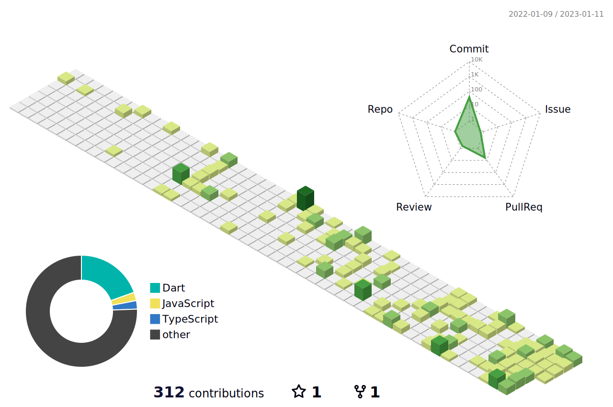

# Hello 👋 World 🌍

<!--   header-background -->

<!--   my-icons -->

    
    
    
    
    
       

<!--   my-skils -->

| Property                                        | Data                                                                                                                                                                                                                                                                                                                                                                                                                                                                                                                                                                                                                                                                                                                                                                                                                                                                                                                                                                                                                                                           |
| ----------------------------------------------- | -------------------------------------------------------------------------------------------------------------------------------------------------------------------------------------------------------------------------------------------------------------------------------------------------------------------------------------------------------------------------------------------------------------------------------------------------------------------------------------------------------------------------------------------------------------------------------------------------------------------------------------------------------------------------------------------------------------------------------------------------------------------------------------------------------------------------------------------------------------------------------------------------------------------------------------------------------------------------------------------------------------------------------------------------------------- |
| **Language**                                    |                                                                                                                                                                                                                                                                                                                                                                                                                                                                                                                                      |
| **IDE**                                         |                                                                                                                                                                                                                                                                                                        |
| **Domain Knownledge**                           |                                                                                                                                                                                                                                                                                                                                                                                                                                                                                                                                      |
| **Machine Learning / Deep Learning Frameworks** |          |
| **OS**                                          |                                                                                                                                                                                                                                                                                                                                                                                                                                                                                                                                                                                                                                                                                                                                                                                                                                                                                                                                                    |
| **Terminal**                                    |                                                                                                                                                                                                                                                                                                                                                                                                                                                                                                                                                                                                                                                                                         |

<!--   GitHub stats graph -->

### 📈 GitHub Activity Graph:

<!--  -->

</img>

<!--   profile-green-animate -->

<!--   grid-snake -->

## Profile Views

Counting of visitors to this page in this section started from on November 20, 2022: 

<!--   footer-background -->

<!---
- 👋 Hi, I’m @mtoan65
- 👀 I’m interested in AI.
- 🌱 I’m currently learning AI.
- 💞️ I’m looking to collaborate on ...
- 📫 How to reach me ...
--->
<!---
mtoan65/mtoan65 is a ✨ special ✨ repository because its `README.md` (this file) appears on your GitHub profile.
You can click the Preview link to take a look at your changes.
--->
